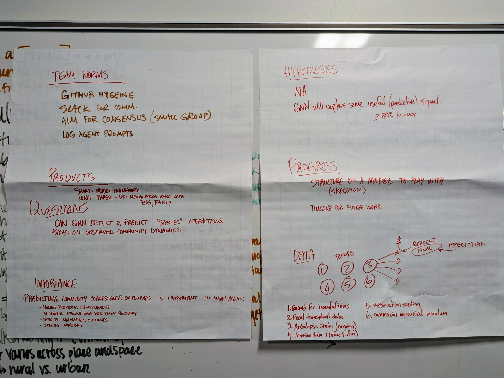
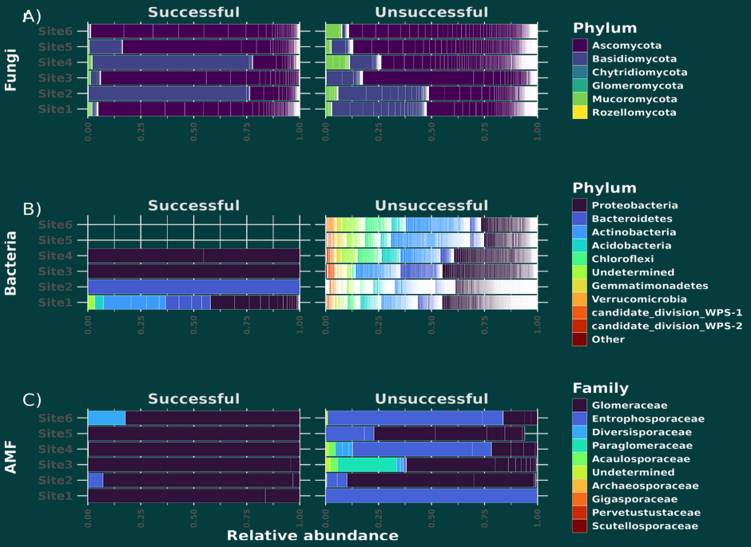

# Predicting community coalescence with GNNs

#### Can a model learn high-order contextual species interactions to predict [community coalescence](https://www.cell.com/trends/ecology-evolution/abstract/S0169-5347(15)00142-1){ .md-button target="_blank" rel="noopener"} outcomes?

!!! tip "For ESIIL staff"
    Group Number: 8
    
    Breakout Room #: S346

    [ESIIL staff edit in Markdown](https://github.com/CU-ESIIL/Summit_group_2026_8/edit/main/docs/index.md?plain=1#L28){ .md-button target="_blank" rel="noopener" }
    

## People { #people .oasis-report-out-context }

!!! note "Day 1 task"
    Get to know your team: share your cards (5-7 mins). Update your team roster (2-3 min).

    Use the in-person name cards to guide quick introductions.

    | Name card prompts | Follow-up notes |
    |---|---|
    |  |  |

    [Edit People in Markdown](https://github.com/CU-ESIIL/Summit_group_2026_8/edit/main/docs/index.md?plain=1#L63){ .md-button target="_blank" rel="noopener" }

| Name | Affiliation | Contact | Github |
|---|---|---|---|
| Geoff Zahn | William & Mary | gzahn@wm.edu | [gzahn.github.io](https://gzahn.github.io/){target="_blank"} |
| Manish Sarkar | Case Western Reserve University | manish.sarkar@case.edu | manishNsarkar|
| Cooper Kimball-Rhines | University of Massachusetts Boston | c.kimballrhines001@umb.edu | [coopermkr.github.io](https://coopermkr.github.io/){target="_blank"} |

## Team Norms and Decision Making { #team-norms-and-decision-making }

!!! note "Day 1 task"

    Suggested Self-Facilitation Instructions:
    
    - Round Robin: Everyone shares 1 norm that they think will be important for their team during the Summit and perhaps following the Summit (2 min).

    - After everyone has shared, make a list with as many norms as possible in GitHub (5–7 min).

    - Vote on your top 3 ideas. (Each person gets 3 votes; you can use all your votes on 1 idea or spread them out) (2 min).

    - In GitHub, move all team norms with votes to the top of the list.

    | Gradients of agreement | 
    |---|
    |  | 

    [Edit Team Norms in Markdown](https://github.com/CU-ESIIL/Summit_group_2026_8/edit/main/docs/index.md?plain=1#L87){ .md-button target="_blank" rel="noopener" }

**Our team norms:**

- Have good github hygeine (Pull often!)
- Use slack for communications
- Log all AI agent prompts and metadata

**Our decision making strategy:**

We are a small group, so we want everyone to agree with major decisions that affect the direction of the project.

## Our product(s) 📣 { #product-direction .oasis-report-out-section .oasis-report-out-day2 }

!!! note "Day 2 Tasks"
    Morning Focus: questions, hypotheses, context; add at least one visual (photo of whiteboard/notes)

    Afternoon Focus: try a few datasets and analyses. Keep it visual, keep it simple. Update the site to reflect what you test. 

    [Edit content below here in Markdown](https://github.com/CU-ESIIL/Summit_group_2026_8/edit/main/docs/index.md?plain=1#L106){ .md-button target="_blank" rel="noopener" }

**Short term:**

- A trial GNN so we can figure out what we need to know/who we need to recruit

**Long term:**

- A publication for the model and framework approach
- A Big and Fancy later publication applying the model to a new research system with public data

*Morning whiteboard or notes showing the question, hypotheses, and context we used to start Day 2.*

## Our question(s) 📣 { #project-question .oasis-report-out-section .oasis-report-out-day2 }

**Our working question:**

- Can we predict a coalescent community from known resident and donor communities?

**What would count as progress:**

- Getting data ready to input into a model
- Developing a model structure
- Having a timeline for future work

## Hypotheses/Intentions

- We hypothesize that a Graphical Neural Network will adequately (>80%) predict community coalescence from resident and donor community compositions.

## Why this matters (the “upshot”) 📣 { #why-this-matters .oasis-report-out-section .oasis-report-out-day2 }

This matters because:

- It applies a novel framework and approach to a simple ecological question: when you combine two communities, who stays?
- A working model would be highly generalizable to many biological systems, both micro and macro.

People who could use this:

- Restoration managers, agriculturalists, human microbiome community, probiotic researchers

## Data sources we’re exploring 📣 { #data-exploration .oasis-report-out-section .oasis-report-out-day2 }

!!! note "data exploration"
    Provide a snapshot showing some initial data patterns. 

    Add 2-4 promising data sources (links +1-line notes)    

*"Success" of various taxonomic groups at establishing after coalescence.*

**Promising data sources:**

- Great Fir Innoculations: Soon to be published data on a controlled seed innoculation experiment
- [Fecal Transplant Data](https://www.ncbi.nlm.nih.gov/bioproject/PRJNA296920) | [Related publication](https://pubmed.ncbi.nlm.nih.gov/28195180/)
- Seed mix restorations (NECASC/RISCC?): After management or removal of invasive species, managers often plant commercial "native plant" seed mixes.

## Methods/technologies we’re testing 📣 { #methods-and-code .oasis-report-out-section .oasis-report-out-day2 }

!!! note "methods"
    Add 2-4 methods/technologies we're testing (stats, models, viz).

[View shared code](https://github.com/CU-ESIIL/Summit_group_2026_8/tree/main/docs/code){ .md-button }

**Methods/technologies we are testing:**

| Method or technology | What we tested | Early note |
|---|---|---|
| PyTorch | Deep Learning Library| Working on data reformatting and getting the model to run |
| TensorFlow | Deep Learning Library | Might transition to this later to use in R using Keras, Reticulate |

### Challenges identified

- We have not coded our own GNNs before
- We lack python skills, but are searching for workarounds in R

### Visuals

### Next Steps

**Short term: **

 - Finalize initial case study data set preparation
 - Initial draft model code completed
 - Identify other collaborator(s) as needed

**Long term: **

 - Build literature base
 - Test & improve model architecture
 - Run 3-4 different cases through model
 - Publish the greatest paper of all time!

!!! note "Day 3 Tasks"
    Sythesis: highlight 2-3 visuals that tell the story; keep text crisp. Practice a 6-minute walkthrough of the homepage. Why -> Questions -> Data/Methods -> Findings -> Next 

    [Edit content below here in Markdown](https://github.com/CU-ESIIL/Summit_group_2026_8/edit/main/docs/index.md?plain=1#L203){ .md-button target="_blank" rel="noopener" }

## Team Photo { #team-photo }

*Team members and collaborators who contributed to this project.*

## Findings at a glance 📣 { #findings-at-a-glance .oasis-report-out-section .oasis-report-out-day3 }

Headline 1 — This type of data is adequate to successfully compile a GNN.

Headline 2 — The GNN performs better on presence/absence data than on abundance data, but the predictive capacity on our initial dataset is still poor.

Headline 3 — Looking at a different dataset (See fecal transplants above) will both broaden applicability into the medical field and might provide cleaner data to train the GNN on.

## Visuals that tell a story 📣 { #story-visuals .oasis-report-out-section .oasis-report-out-day3 }

*Visual 1: Model loss showing convergence*

*Visual 2: The GNN performs poorly on community abundance data, but still performs slightly better than random chance on presence/absence.*

## What’s next? 📣 { #whats-next .oasis-report-out-section .oasis-report-out-day3 }

Short term:

- Prepare a cleaner dataset to determine if the issue is with the data or the model architecture.

Long term:

- Finalize a model architecture and test it with multiple types of data including medical, restoration, and agricultural community coalescence experiments.

Who should see this next

- Someone who understands GNNs better than we do.

## Cite & Reuse { #cite-reuse }

If you use these materials, please cite:

Summit Team. (2026). *Summit Group 2026 Team 8 — Innovation Summit 2026*. https://github.com/CU-ESIIL/Summit_group_2026_8

License: CC-BY-4.0 unless noted. 
